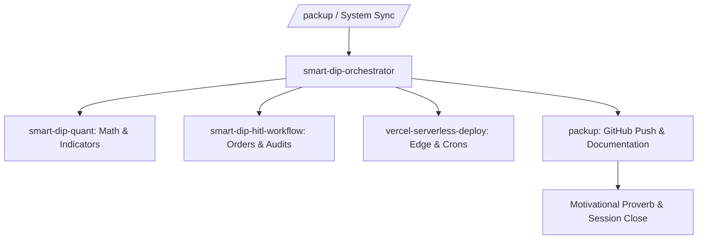

# Smart Dip Orchestrator (Master Pipeline Trigger)

This skill serves as the central conductor for the Smart Dip Accumulator. When `/packup` or a full system sync is triggered, this skill orchestrates all individual sub-skills and slash command capabilities.

---

## Orchestrated Skills Sequence

### 1. Quantitative Verification (`smart-dip-quant`)
- Validates that `api/quant.py` executes cleanly.
- Checks that 14-period RSI and 50-day EMA calculation formulas meet the >99% precision threshold.

### 2. Safeguard & Audit Validation (`smart-dip-hitl-workflow`)
- Ensures no automated orders bypass user approval.
- Validates the tabular application logs and chat token ledger.

### 3. Serverless Readiness (`vercel-serverless-deploy`)
- Checks `vercel.json` crons and headers.
- Confirms that the in-memory `/tmp` fallback functions properly for zero-touch deployments.

### 4. Git Synchronization & Documentation (`packup`)
- Automatically generates git commits and pushes to GitHub `origin main`.
- Updates all project documentation and walkthroughs.
- Formats session metrics and displays the closing proverb.
